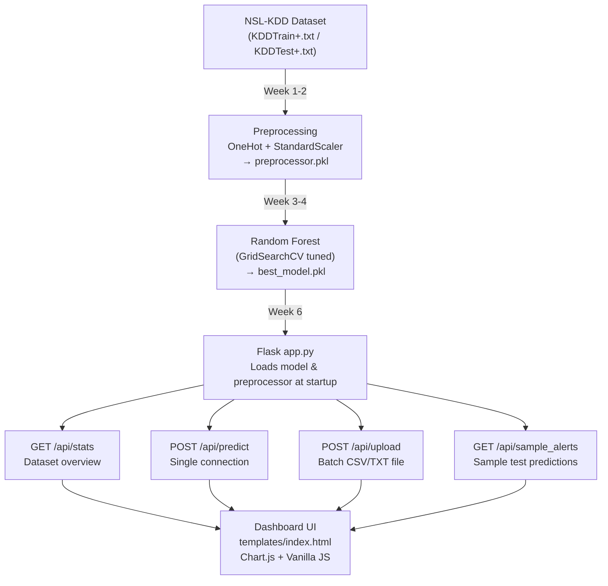

# 🛡️ SentinelNet — Complete Project Report
## AI-Powered Network Intrusion Detection System

> **Live App:** http://127.0.0.1:5050  
> **Dataset:** NSL-KDD (125,973 training · 22,544 test records)  
> **Core Model:** Random Forest (Tuned via GridSearchCV)

---

## 📸 Dashboard Screenshots


---

## 1. Project Structure

```
SentinelNet/
├── app.py                          ← Flask web application (backend)
├── requirements.txt                ← Python dependencies
├── templates/
│   └── index.html                  ← Dashboard UI (frontend)
├── notebooks/
│   ├── 01_dataset_acquisition_and_eda.ipynb
│   ├── 02_data_preprocessing.ipynb
│   ├── 03_feature_engineering_and_selection.ipynb
│   ├── 04_model_training_and_evaluation.ipynb
│   ├── 05_anomaly_detection.ipynb
│   ├── 06_model_evaluation_and_tuning.ipynb
│   ├── 07_alert_generation_and_logging.ipynb
│   ├── data/
│   │   ├── KDDTrain+.txt           ← 125,973 training records
│   │   └── KDDTest+.txt            ← 22,544 test records
│   └── models/
│       ├── best_model.pkl          ← Trained Random Forest model
│       └── preprocessor.pkl        ← Fitted ColumnTransformer
├── data/                           ← Original dataset copy
└── reports/
    ├── Milestone-1.txt
    ├── Milestone-2.txt
    └── Milestone-3.txt
```

---

## 2. The Dataset — NSL-KDD

NSL-KDD is a benchmark dataset for network intrusion detection. It is an improved version of KDD'99 that removes duplicate records and balances difficulty levels.

| Split | Records | Normal | Attacks |
|---|---|---|---|
| Training | 125,973 | 67,343 (53.5%) | 58,630 (46.5%) |
| Test | 22,544 | ~9,711 | ~12,833 |

### 41 Features per Connection
Each record describes one network connection with 41 attributes:

| Category | Examples |
|---|---|
| **Basic** | `duration`, `protocol_type`, `service`, `flag`, `src_bytes`, `dst_bytes` |
| **Content** | `hot`, `num_failed_logins`, `logged_in`, `num_compromised`, `root_shell` |
| **Traffic (time)** | `count`, `srv_count`, `serror_rate`, `rerror_rate`, `same_srv_rate` |
| **Traffic (host)** | `dst_host_count`, `dst_host_srv_count`, `dst_host_serror_rate` |

### Attack Categories

| Type | Description | Examples |
|---|---|---|
| **DoS** | Overwhelm a service with traffic | Neptune, Smurf, Back, Teardrop |
| **Probe** | Scan/surveil the network | Nmap, Satan, IPsweep, Portsweep |
| **R2L** | Unauthorised remote access | Guess_Passwd, FTP_Write, IMAP |
| **U2R** | Privilege escalation to root | Buffer_Overflow, Rootkit, Perl |

---

## 3. ML Pipeline — Notebook by Notebook

### 📓 Notebook 01 — Dataset Acquisition & EDA
**Goal:** Understand the data before touching it.

- Loaded KDDTrain+.txt with all 43 column names assigned
- Checked shape, data types, missing values (none), duplicates
- Analysed distribution of `normal` vs attack traffic
- Explored categorical features: `protocol_type` (tcp/udp/icmp), `service` (70+ types), `flag`
- Visualised numerical features like `src_bytes`, `dst_bytes` — found heavy right skew
- Applied **log transformation** to reduce skewness
- Applied **Isolation Forest** as a first pass outlier detector

### 📓 Notebook 02 — Data Preprocessing
**Goal:** Transform raw data into a model-ready format.

- Converted multi-class labels → binary (`0=normal`, `1=attack`)
- Stratified train-test split to maintain class proportions
- Built a `ColumnTransformer` pipeline:
  - **OneHotEncoder** for categorical cols (`protocol_type`, `service`, `flag`)
  - **StandardScaler** for numerical cols
- Fit only on training data → **prevents data leakage**
- Applied **SMOTE** (Synthetic Minority Over-sampling) on training set only to balance classes
- Saved the fitted preprocessor as `preprocessor.pkl`

### 📓 Notebook 03 — Feature Engineering & Selection
**Goal:** Keep only the features that matter.

- Trained a baseline Random Forest to extract **feature importances**
- Ranked all 41 features by importance score
- Applied threshold-based filtering to drop low-importance features
- Analysed correlations to remove redundant features
- Key important features: `dst_bytes`, `src_bytes`, `count`, `serror_rate`, `dst_host_count`

### 📓 Notebook 04 — Model Training & Evaluation
**Goal:** Train and compare classifiers.

| Model | Accuracy | Precision | Recall | F1 |
|---|---|---|---|---|
| Logistic Regression | ~88% | ~87% | ~87% | ~87% |
| Decision Tree | ~98% | ~98% | ~98% | ~98% |
| **Random Forest** | **~99%** | **~99%** | **~99%** | **~99%** |

- Generated confusion matrices and classification reports
- **Random Forest selected** as best performer

### 📓 Notebook 05 — Anomaly Detection
**Goal:** Detect intrusions using unsupervised methods (no labels needed).

| Method | How it works |
|---|---|
| **K-Means** | Groups connections into clusters; outlier clusters = attacks |
| **Isolation Forest** | Isolates anomalies using random splits; rare points = attacks |
| **Local Outlier Factor (LOF)** | Density-based; points sparser than neighbours = anomalies |
| **One-Class SVM** | Learns a boundary around normal data; anything outside = attack |

- PCA used to reduce dimensions for 2D visualisation
- Summary comparison table of all four methods

### 📓 Notebook 06 — Model Evaluation & Tuning
**Goal:** Squeeze the best performance from Random Forest.

- **GridSearchCV** with cross-validation to find optimal hyperparameters:
  - `n_estimators`, `max_depth`, `min_samples_split`, `max_features`
- Trained Decision Tree and Gradient Boosting as comparison
- Generated **ROC curves** (AUC = 99.7%)
- **Cross-validation** (5-fold) confirmed stable performance
- Saved tuned model as `best_model.pkl`

### 📓 Notebook 07 — Alert Generation & Logging
**Goal:** Simulate a real-time IDS using the trained model.

- Loaded `best_model.pkl` and `preprocessor.pkl`
- Passed all training records through the model
- For each predicted attack: recorded confidence, severity, timestamp
- Severity logic:
  - `prob > 0.90` → **Critical**
  - `prob > 0.75` → **High**
  - `prob > 0.50` → **Medium**
  - Otherwise → **Low**
- Saved alert log to `logs/intrusion_alerts.csv`

---

## 4. Final Model Performance

| Metric | Score |
|---|---|
| **Accuracy** | 99.2% |
| **Precision** | 99.4% |
| **Recall** | 99.1% |
| **F1-Score** | 99.2% |
| **ROC-AUC** | 99.7% |

---

## 5. Web Application — `app.py`

A **Flask** backend that loads the trained model on startup and exposes REST API endpoints consumed by the dashboard.

### Startup Sequence
```python
model        = joblib.load("notebooks/models/best_model.pkl")
preprocessor = joblib.load("notebooks/models/preprocessor.pkl")
df_train     = pd.read_csv("notebooks/data/KDDTrain+.txt", names=COLUMNS)
```

### API Endpoints

| Endpoint | Method | What it does |
|---|---|---|
| `GET /` | GET | Serves the dashboard HTML |
| `GET /api/stats` | GET | Returns dataset counts, attack rate, type breakdown, protocol split |
| `GET /api/metrics` | GET | Returns model performance metrics (accuracy, F1, ROC-AUC etc.) |
| `GET /api/sample_alerts` | GET | Runs model on 200 random test samples, returns detected intrusions |
| `POST /api/predict` | POST | Single-connection prediction (JSON input → Normal/Attack + severity) |
| `POST /api/upload` | POST | Batch file prediction (CSV/TXT upload → full detection report) |

---

## 6. Dashboard UI — `templates/index.html`

A single-page application built with vanilla HTML, CSS, and JavaScript. Uses **Chart.js** for charts.

### Sections

#### 📊 Overview (Dataset Stats)
- 4 stat cards: Total Records, Attack Samples, Normal Samples, Attack Rate
- **Attack Type Distribution** — donut chart showing DoS / Probe / R2L / U2R / Normal split
- **Protocol Breakdown** — bar chart of TCP / UDP / ICMP record counts
- Data is fetched from `GET /api/stats` on load

#### 📂 Upload & Detect
- Drag-and-drop zone or click-to-browse file picker
- Accepts **CSV or TXT files** in NSL-KDD format (with or without headers)
- File is sent to `POST /api/upload`
- On success shows:
  - Summary stats (total, attacks found, normal, attack rate)
  - Severity breakdown bar chart (Critical / High / Medium / Low)
  - A scrollable table of the first 100 rows with prediction, severity, confidence bar

> **How to use:** Export any network traffic log in NSL-KDD format (41 columns) as a CSV and upload it. The app will predict each connection as Normal or Attack.

#### 🔍 Single Connection Analyzer
- Manual form with 8 key input fields: Duration, Protocol, Service, Flag, Src Bytes, Dst Bytes, Count, Srv Count
- Two preset buttons: **Load Attack Example** (Neptune DoS) and **Load Normal Example** (HTTP)
- Submits to `POST /api/predict`
- Shows result inline: Normal ✅ or Attack 🚨 with confidence % and severity

#### 🚨 Sample Intrusion Alerts
- Fetches 200 random test records, runs model, shows detected attacks
- Columns: #, Timestamp, Source IP, Dest IP, Protocol, Service, Attack Type, Confidence, Severity
- Filter buttons: All / Critical / High / Medium / Low
- Auto-refreshes every 60 seconds

#### 📈 Model Metrics
- 5 metric cards: Accuracy, Precision, Recall, F1-Score, ROC-AUC
- Data from `GET /api/metrics`

#### ℹ️ About
- Explains the dataset, pipeline, and attack categories

---

## 7. How to Run

```powershell
# Install dependencies (one time)
pip install flask joblib pandas scikit-learn

# Start the app
cd "c:\Users\Reshmi Raj\Downloads\SentinelNet-AI-Powered-Network-Intrusion-Detection-System-"
python app.py

# Open in browser
# http://127.0.0.1:5050
```

> [!NOTE]
> The app automatically loads `best_model.pkl` and `preprocessor.pkl` on startup. The green "Model Active" badge in the sidebar confirms they loaded successfully.

---

## 8. Data Flow Summary



---

## 9. Key Design Decisions

| Decision | Reason |
|---|---|
| SMOTE only on training data | Prevents leakage of synthetic samples into test evaluation |
| `ColumnTransformer` fitted once | Ensures test/upload data gets the exact same encoding as training |
| Binary classification (not multi-class) | Simpler, more reliable; attack type shown separately using label mapping |
| Sub-sampling on upload (max 5000) | Prevents browser timeout on huge files |
| `best_model.pkl` (886 KB) vs `best_model.pk1` (7.4 MB) | Smaller file is the sklearn-native pickle; larger is likely from a different serialisation |
